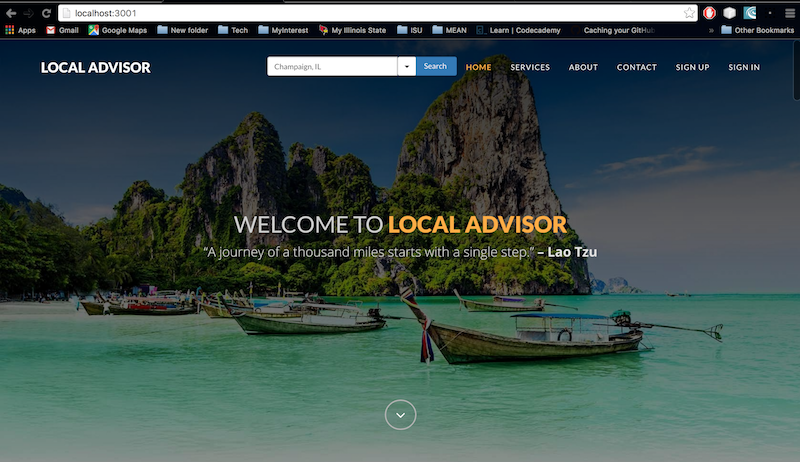
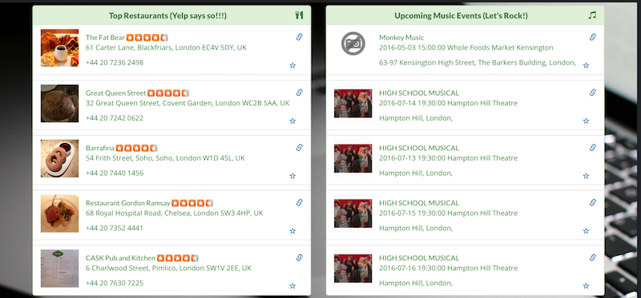
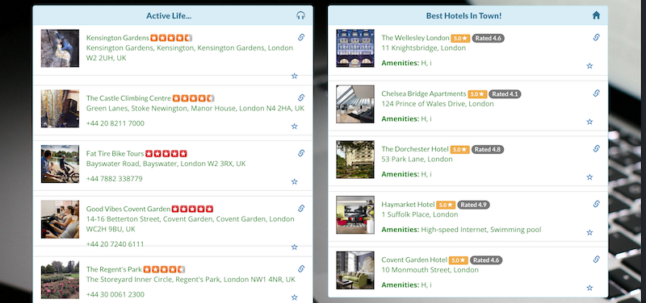
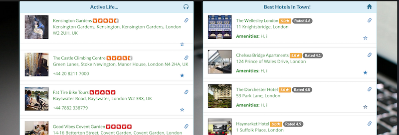

# Local Advisor

Get informations about upcoming events, local food, weather, hotels and places to visit near you

## Prerequisite Technologies
### Linux
* *Node.js* - <a href="http://nodejs.org/download/">Download</a> and Install Node.js. <a href=" http://nodeschool.io/#workshoppers">Node tutorials</a> from nodeschool have valuable resources to get more knowledge on Nodejs.
* *MongoDB* - <a href="https://www.mongodb.org/downloads">Download</a> and Install mongodb - <a href="https://docs.mongodb.org/manual/">Checkout their manual</a> if you're just starting.

If you're using ubuntu, this is the preferred repository to use...

```bash
$ curl -sL https://deb.nodesource.com/setup | sudo bash -
$ sudo apt-get update
$ sudo apt-get install nodejs
```

* *Git* - Get git using a package manager or <a href="http://git-scm.com/downloads">download</a> it.

### Windows
* *Node.js* - <a href="http://nodejs.org/download/">Download</a> and Install Node.js. <a href=" http://nodeschool.io/#workshoppers">Node tutorials</a> from nodeschool have valuable resources to get more knowledge on Nodejs.
* *MongoDB* - Follow the great tutorial from the mongodb site - <a href="https://docs.mongodb.org/manual/tutorial/install-mongodb-on-windows/">"Install Mongodb On Windows"</a>
* *Git* - The easiest way to install git and then run the rest of the commands through the *git bash* application (via command prompt) is by downloading and installing <a href="http://git-scm.com/download/win">Git for Windows</a>

### OSX
* *Node.js* -  <a href="http://nodejs.org/download/">Download</a> and Install Node.js or use the packages within brew or macports.
* *MongoDB* - Follow the tutorial here - <a href="https://docs.mongodb.org/manual/tutorial/install-mongodb-on-os-x/">Install mongodb on OSX</a>
* *git* - Get git <a href="http://git-scm.com/download/mac">from here</a>.


## Installation

* Clone this repository
```
$ git clone https://github.com/sonalicsharma/localAdvisor.git
```

* Install Module Dependencies. For people new to these concepts, <a href="https://www.npmjs.com/">npm</a> is the package manager for Nodejs. <a href="http://bower.io/">Bower</a> is the package manager to manage dependencies on the client side.
```
$ npm install		# From cloned repo directory
$ bower install
```

## Running the Application

1. Make sure to start your MongoDB server in the default port of 27017. Please refer prerequisite section above to install MongoDB and start it.

1. Open another terminal, go to the cloned repo directory and run
```bash
$ npm start
```
1. Then, open a browser and go to:
```bash
http://localhost:3001
```

## Screenshots of the Application
### Basic Layout:
The home page of the application. On signing in, the welcome message displays the user name.



Services section shows the informations available about the searched location.


About section is a brief summary about the motive behind the application.


Contact section:


Sign Up popup allows you to create a profile. You may then sign in to save searched locations and favorite listings.


Sign In popup form:


After successful sign in:


### Search functionality:

Search results for London, UK. They will be available under Services section.







### Favorite Cities:
After signing in, you may bookmark a searched location to favorite list.


London is successfully added to the favorite city list.


### Favorite Listings:

Favorite listing functionality allows users to save their favorite listing in various categories for future references. They can favorite/unfavorite it clicking by the star near the listing



Users can view their favorite added listing in the favorites section. The favorite section also preserves the links to the original detail pages from the 3rd party apis so that the user can directly navigate there.


Users can also add notes to refer later. They can also add custom favorites and remove existing favorites.


